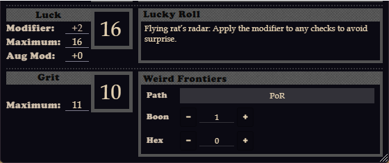

# DCC RPG Character Sheet Customizer
Add custom fields and abilities to your DCC RPG character sheets in Foundry VTT!



*A custom "Grit" ability (Current/Max) alongside the core Luck ability, plus a
custom "Weird Frontiers" panel using a Text field (Path) and two
Resource/Counter-style fields (Boon, Hex).*

## Features

### Eight Field Types

1. **Text** - Simple text input field
2. **Number** - Numeric input field
3. **Current/Max** - Track resources with current and maximum values (appears in abilities section)
4. **Counter** - Number field with increment/decrement buttons
5. **Resource** - Current/Max with +/- buttons on Current only, clamped between 0 and Max; the GM sets a Default Max per field
6. **Choice** - A GM-defined dropdown (one option per line)
7. **Toggle** - A simple on/off checkbox
8. **Custom Ability** - Full ability score with value, max, and auto-calculated modifier (appears in abilities section)

### Smart Placement

- **Ability Fields** (Custom Ability & Current/Max) automatically appear in the abilities section below Luck, styled to match core abilities
- **Panel Fields** (Text, Number, Counter, Resource, Choice, Toggle) appear in configurable panels at the top or bottom of character sheets

### Roll Integration

Custom abilities are fully integrated with the DCC roll system:
- Roll ability checks by clicking the ability name
- Each custom ability has an editable **Roll Key** (e.g. `sanity`) used in formulas:
  `@sanityMod` or `@customAbilities.sanity.value`
- Modifiers auto-calculate using DCC ability score table (3-24)
- Roll Keys can't collide with each other or with DCC's own roll data (`str`, `hp`,
  `ac`, etc.) — the config dialog validates this when you save

#### Rollable Custom Abilities

Custom Ability and Current/Max fields have a **Rollable** option (on by
default for Custom Ability, matching prior versions). When enabled, you get:

- **Roll Name** - the label shown on the roll (defaults to the field's own label)
- **Source** - what the roll is based on: the ability's own value/mod, one of
  the six core ability modifiers (Strength, Agility, Stamina, Personality,
  Intelligence, Luck), one of the three saves (Fortitude, Reflex, Will), or a
  freeform **Custom Formula**
- **Roll Under** - mirrors DCC's own Luck check: a naked d20 compared against
  the score, instead of d20 + modifier

Rolling a custom ability goes through the same `DCCRoll` API and modifier
dialog real DCC ability checks use, so it behaves exactly like rolling a core
ability - including respecting Ctrl-click and the "show roll modifier by
default" setting.

### PC / NPC Scoping

Each custom ability and each custom panel has an **Applies To** setting: **Both**,
**PC Only**, or **NPC Only**. Use this when a field only makes sense for one actor
type, e.g. a Sanity ability for player characters, or a Morale tracker just for
NPCs. Defaults to Both, matching prior versions where every field appeared
everywhere.

## Installation

1. In Foundry VTT, go to **Add-on Modules**
2. Click **Install Module**
3. Search for "DCC RPG Character Sheet Customizer"
4. Click **Install**

**OR**

Paste this manifest URL:
```
https://github.com/mummson/dccrpg-character-sheet-customizer/releases/latest/download/module.json
```

## Usage

### Initial Setup

1. Enable the module in your world
2. Go to **Settings** → **Module Settings**
3. Find "DCC RPG Character Sheet Customizer"
4. Click **Configure Custom Fields**

### Adding Panels and Fields

1. Click **Add Panel** to create a new panel
2. Give it a name (e.g., "Sanity & Corruption")
3. Choose **Applies To**: Both, PC Only, or NPC Only
4. Click **Add Field** to add fields to the panel
5. Configure each field:
   - **Label**: Display name
   - **Type**: Choose from 5 field types (each type has a one-line description in
     the dialog to help you pick)

Custom abilities have the same **Applies To** option, next to their type selector,
plus a **Roll Key** (see Roll Integration above) instead of a Type ID — panel fields
aren't usable in roll formulas, so they don't have one.

### Field Type Examples

**Custom Ability (Sanity)**
- Label: `Sanity`
- Type: `Custom Ability`
- Roll Key: `sanity`
- Creates a full ability score with modifier
- Appears below Luck in abilities section
- Use in rolls: `@sanityMod`

**Current/Max (Corruption)**
- Label: `Corruption`
- Type: `Current/Max`
- Roll Key: `corruption`
- Track current and max values (no modifier)
- Appears below Luck in abilities section
- Use in rolls: `@customAbilities.corruption.value` (current value) or
  `@customAbilities.corruption.max`

**Counter (Luck Pool)**
- Label: `Luck Pool`
- Type: `Counter`
- Easy increment/decrement buttons
- Appears in panel

### Saving Configuration

1. Click **Save Configuration**
2. Close and re-open character sheets to see changes
3. Values persist per actor automatically

## Roll Formula Examples

```javascript
// Roll a custom ability check
1d20 + @sanityMod
```

`@sanityMod`-style keys resolve anywhere Foundry passes the actor's own
roll data into a formula (chat rolls, macros). Whether that includes a
given item's formula field depends on that item type's own roll code, not
on this module, check that it works before relying on it in, say, a
weapon's damage formula.

## Technical Details

### Data Storage

- **Configuration**: Stored in world settings
- **Field Values**: Stored in actor flags
- **Custom Abilities**: Stored separately for roll data integration

### Compatibility

- **Foundry VTT**: v13+ (verified on v14)
- **DCC System**: v0.19.0+
- Works with both PC and NPC sheets, with per-field PC/NPC/Both scoping (see above)

### Performance

- Debounced auto-save (300ms)
- Idempotent rendering (no duplicates)
- Minimal CSS overrides using system variables

## Troubleshooting

### Fields Not Appearing

1. Make sure you've saved the configuration
2. Close and re-open the character sheet
3. Check console for errors (F12)

### Roll Formulas Not Working

- Use the exact **Roll Key** shown in the ability's row in the config dialog
- Format: `@rollKeyMod` or `@customAbilities.rollKey.value`
- Roll Keys are always lowercase — the dialog normalizes casing automatically

### Styling Issues

The module uses DCC system CSS variables. If styles look wrong:
1. Update to latest DCC system version
2. Check for conflicting modules
3. Try disabling other sheet-modifying modules

## Contributing

Contributions welcome! Please:
1. Fork the repository
2. Create a feature branch
3. Submit a pull request

## License

[MIT License](LICENSE)

## Credits

- Created for the DCC RPG Foundry VTT system
- Inspired by the flexibility needed for homebrew content
- Built with ❤️ for the DCC community

## Changelog

See [CHANGELOG.md](CHANGELOG.md).

## Support

- **Issues**: [GitHub Issues](https://github.com/mummson/dccrpg-character-sheet-customizer/issues)
- **Discord**: dr_mummson
